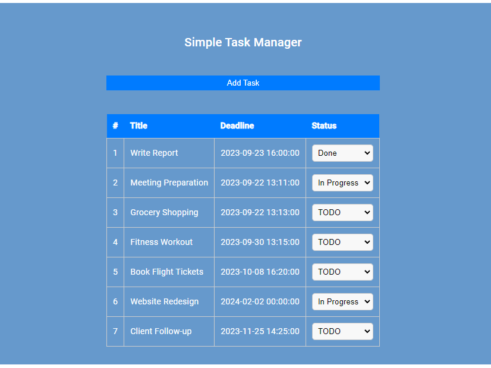
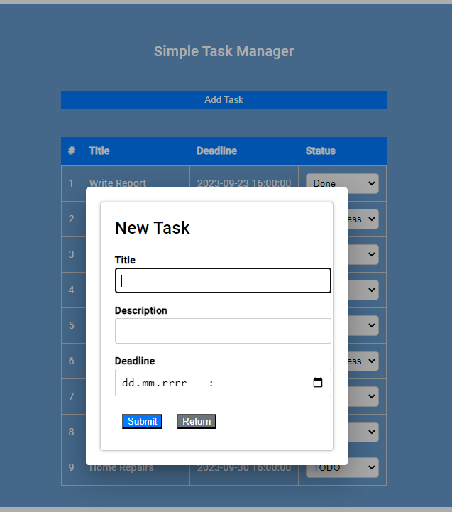
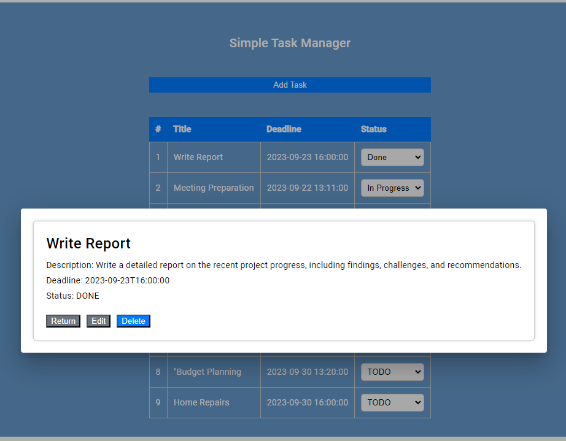
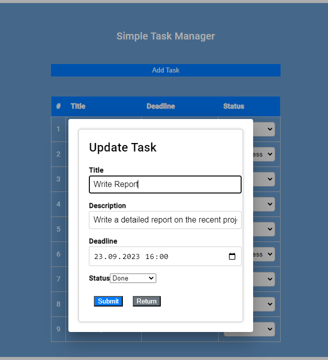

# SIMPLE TASK MANAGER

Application is designed to manage and organize tasks.
Application allows to add, edit and remove tasks from list.
Tasks are listed on the main page. You can sort them either by deadline or status by clicking adequate header.

###
#### MySQL docker container
To set up MySQL database on your local machine you have to download and 
install docker on your machine, preferably Docker Desktop 
(reference: https://www.docker.com/products/docker-desktop/).  
With docker installed open terminal and type `docker compose up` 
inside project root folder. 

#### Prettier
Project has prettier configured. To keep code formatted you have to download node.js.
After downloading node.js use following command:  `npm install --global prettier`  
If you are using Intellij IDEA (preferable IDE) here is reference to further prettier config https://www.jetbrains.com/help/idea/prettier.html#ws_prettier_configure

#### Angular
Frontend is written in Angular. To install Angular CLI type  `npm install -g @angular/cli` in terminal.
Before installing Angular CLI you should have node.js already downloaded, installed and configured.

#### Sass 
To install and configure it in your IDE (preferably Intellij IDEA) follow this reference document: https://www.jetbrains.com/help/idea/transpiling-sass-less-and-scss-to-css.html#install_sass_scss

###
### Running application on local environment

To run application on your local machine preferably use Intellij IDEA.

#### Database
To run database navigate to the project root and execute below command in command line (Bash, Powershell etc.):  
`docker compose up`. Database MySQL container is served on 3306 port.

#### Backend
To run backend navigate to the project root and execute below command in command line (Bash, Powershell etc.):  
`mvn spring-boot:run` or configure local run config in Intellij IDEA and execute it. Backend is served on 8080 port.
Application provides following API:
* POST /api/task - request to create task with following JSON body: 
  * title: string
  * description: string
  * deadline: date in format: yyyy-MM-ddThh:mm:ss
  * status: string enum ("TODO", "IN_PROGRESS", "DONE")
* PUT /api/task - request to update task with following JSON body:  
  * id: number 
  * title: string
  * description: string
  * deadline: date in format: yyyy-MM-ddThh:mm:ss
  * status: string enum ("TODO", "IN_PROGRESS", "DONE")
* GET /api/task/{taskId} - request to get task with given id as a path variable
* GET /api/task - request to get all tasks
* DELETE /api/task/{taskId} - request to remove task with given id as a path variable

#### Frontend
To run frontend navigate to the angularclient project root and execute below command in command line (Bash, Powershell etc.):  
`ng serve --open` or configure local run config in Intellij IDEA and execute it. Frontend is served on 4200 port.

###
#### Application demo
 Main page

   

Adding new task

  

Task details

  

Updating existing task

